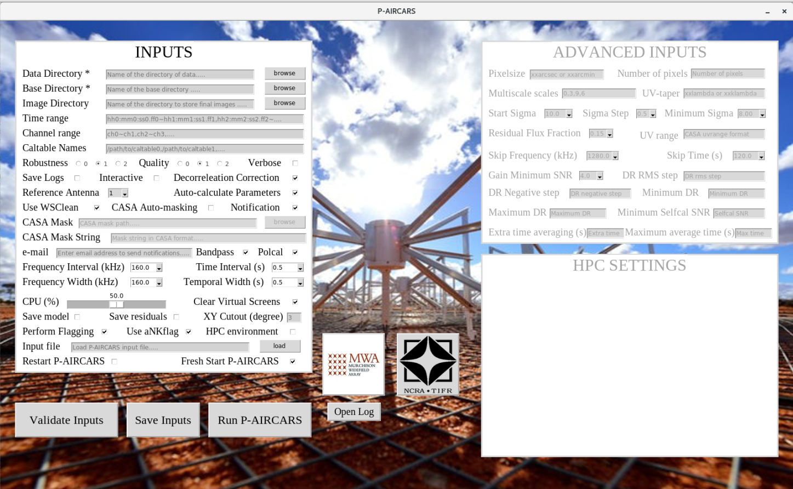

Tutorial
========
P-AIRCARS is a user-friendly and robust pipeline. In this tutorial we will learn how to run P-AIRCARS on a set of solar observations from MWA in default mode.

Start the P-AIRCARS
*******************
1. Open your terminal

2. Type 'go\_paircars' and press enter

   ``>> go_paircars``

3. P-AIRCARS input window will pop up.

 

Download the data
*****************

Fill up the inputs
******************
++++++++++++
Manual input
++++++++++++

Two inputs are mandatory

1. *Data directory* : Name of the directory where all measurement setsto be imaged are present. User can type the full directory path in the entry box or use the browse button to select the directory.

2. *Base directory* : Name of the base directory where all the calibration and imaging will be done. User can type the full directory path in the entry box or use the browse button to select the directory.

+++++++++++++++++++++++++++++
Load from previous input file
+++++++++++++++++++++++++++++
If a previous P-AIRCARS input file with '.paircars' exists, inputs can be filled automatically from that input file. To do that follow the steps

1. Press the *load* button at the right of the **Input file** at the bottom of the INPUTS block and select the input file.

2. Select the file and click *open* and it will automatically load the input file and fill the inputs.

Validating inputs
*****************
After filling the inputs either manually or from a previous input file, user can validate if all inputs are correct or not.

1. Click **Validate Inputs** button at the bottom of the INPUTS.

2. If inputs are correct a pop up message will be shown saying, "Inputs are correct".

3.If mandatory inputs are missing it will show "Mandatory inputs are missing".
  Check if all mandatory inputs are given or not.

Save inputs
***********
If user wants P-AIRCARS inputs can be saved in a '.paircars' file.

1. Click **Save Inputs** button at the bottom.

2. A file dialog box will pop up. Default directory is your present derectory and default file name is 'inputs.paircars'. User may change the directory and file name.

3. Click on *save* to the inputs.

4. If the input file saved successfully a pop up message will show the location where the input file saved. Otherwise it will show error.

Run the P-AIRCARS
*****************
After giving all the mandatory inputs, we are now ready to start the P-AIRCARS.

1. Click on **Run P-AIRCARS** button at the bottom.

2. If P-AIRCARS is already running or interupted at the same base directory, a pop up message will ask 'P-AIRCARS already running in the base directory. Do you really want to over run?'

3. If you want to re-run P-AIRCARS in the same base directory overriding the present running P-AIRCARS, press *yes* , otherwise press *no*.

4. If you press *yes*, P-AIRCARS will start. It may take some time to start. When started a pop up message will show 'P-AIRCARS has started. Job ID : your_job_id'.

5. Note down the Job ID. You can use this Job ID to track the progress of the P-AIRCARS.

6. If you have started P-AIRCARS, it will start after pressing **Run P-AIRCARS** button and pop message will show the Job ID.

Notification over e-mail
************************
User can get the updates about the progress of p-AIRCARS in their e-mail. To enable this feature follow the steps

1. Select the *Notification* button.

2. Put the e-mail id of the user in the *e-mail* entry box.

Locate the final images
***********************
If you give some custom path to save final images in the *Image Directory*, final images will be saved there. Otherwise, final images will be saved in a sub-directory named 'final_images' inside the *Base Directory*.

 

